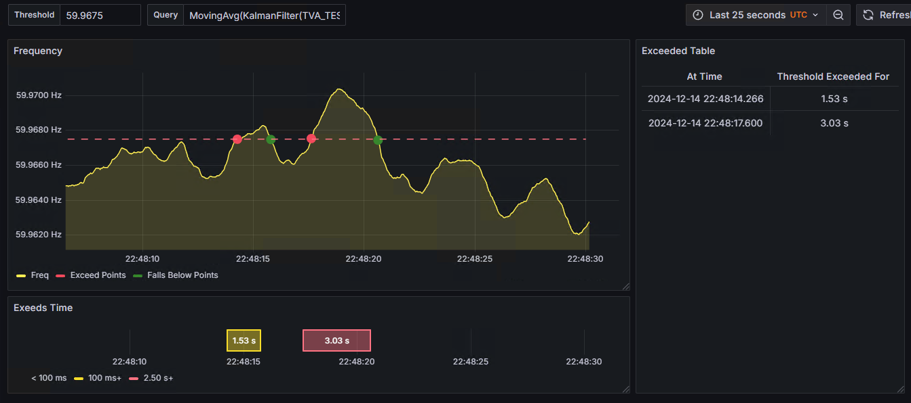

# openHistorian Grafana Data Source Templates

### References
* [openHistorian](https://github.com/GridProtectionAlliance/openHistorian)
* [Grafana](https://grafana.com/grafana/)
* [openHistorian Grafana Data Source](https://grafana.com/grafana/plugins/gridprotectionalliance-openhistorian-datasource/)
* [GSF Grafana Functions](https://github.com/GridProtectionAlliance/gsf/blob/master/Source/Documentation/GrafanaFunctions.md)

---

## `ExceedsAt` Threshold Dashboard
> Download Template: <a id="raw-url" href="templates/ExceedsAtThreshold.json" download>ExceedsAtThreshold.json</a>

This dashboard serves as a real-time threshold monitoring tool, designed to track and visualize when a specific metric exceeds or falls below a predefined threshold. It highlights threshold breaches on a dynamic time-series graph, marking exceedance points and return-to-normal points for clarity. A detailed log provides timestamps and durations of these breaches, enabling users to pinpoint critical events. Additionally, exceedance durations are categorized visually, helping to identify trends or patterns over time. This functionality is particularly useful as a template for monitoring systems where deviations from expected values are significant, such as quality control, anomaly detection, or performance monitoring. 



### Noteworthy Dashboard Details
Dashboard defines `threshold` and `query` editable variables. All panels use the same query via the `query` variable. The "Time series" panel defines four queries:
```bash
Label(Freq, ${query});
Label(Exceed Points, ExceedsAt(${threshold}, ${query}));
Label(Falls Below Points, ExceedsAt(${threshold}, true, ${query}))
Label(threshold, eval(1, { ${threshold} }, ${query}));
```
Overrides for "Exceed Points" and "Falls Below Points" define "Graph styles > styles" as "Points". To define dashed threshold line based on editable `threshold`, `eval` query exposes `threshold` value as a series with a constant value, overriding "Standard options > Color scheme", "Graph styles > Fill opacity", "Graph styles > Line style", and "Series > Hide in area" hiding "Tooltip" and "Legend". 

The "State time line" panel includes both start and end reports from the `ExceedsAt` function and reports duration instead of values. The label includes special blank characters to align panel's time axis with time series panel above:
```bash
Label('͏ ͏ ͏ ͏ ͏ ͏ ͏ ͏ ͏ ͏͏ ͏', ExceedsAt(${threshold}, false, true, true, ${query}));
```
---